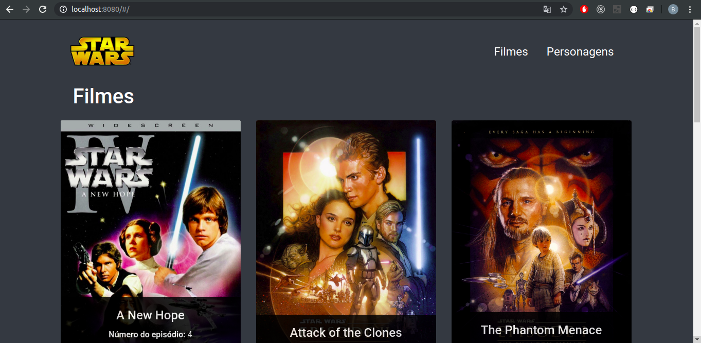

# desafio-enercred


## Instalar Dependências
```sh
# clonar ou baixar projeto
git clone https://github.com/Briuor/Desafio-Star-Wars-Enercred.git

# após clonar, ir para o diretório do projeto
cd Desafio-Star-Wars-Enercred/

# digitar o comando abaixo para instalar as dependências do projeto
yarn
```

### Executar Projeto
```sh
# após instalar as dependências, digitar o comando abaixo para compilar e executar o projeto
yarn serve
```

### Observação:
Como não era obrigatório o uso de um banco de dados, para mostrar as imagens dos filmes renderizei cada imagem de acordo com o "episode_id" de cada filme, quando o usuário selecionar o filme o path da imagem eh guardado no cache do navegador utilizando a propriedade [localStorage](https://developer.mozilla.org/pt-BR/docs/Web/API/Window/Window.localStorage) do próprio javascript. Utilizar um banco de dados para resolver a questão da imagem seria a melhor opção, porém como não era obrigatório optei por uma solução mais ágil.
